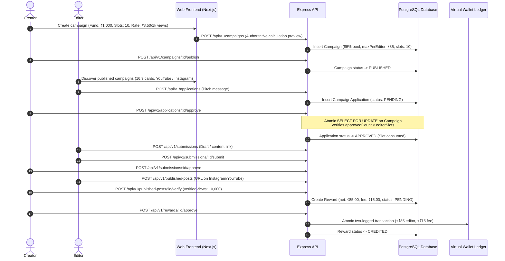

# End-to-End Workflow – CreatorFlow Application

This document outlines the full lifecycle of a campaign in CreatorFlow: from campaign creation and slot-based financial allocation to editor content submissions, view verification, and wallet payouts.

---

## 1. Complete Workflow Diagram

---

## 2. Detailed Step-by-Step Execution

### Step 1: Campaign Creation & Financial Breakdown
1. Creator defines:
   - `campaignFund`: Total budget (e.g. ₹1,000 = 100,000 paise).
   - `editorSlots`: Allowed editor slots (e.g. 10).
   - `earningPer1000Views`: Payout rate per 1k verified views (e.g. ₹8.50 = 850 paise).
   - `minimumViews`: Minimum target views (e.g. 1,000).
   - `socialPlatform`: Strictly `Instagram` or `YouTube`.
2. Backend computes:
   - Platform fee (15%): ₹150 (15,000 paise).
   - Editor pool (85%): ₹850 (85,000 paise).
   - Maximum earning per editor: ₹85 (8,500 paise).
3. Creator publishes campaign to marketplace.

### Step 2: Editor Discovery & Application
1. Editors browse marketplace filtered by `Instagram` or `YouTube`.
2. Cards display remaining slots, max earning potential, and view rates.
3. Editor submits pitch. Database enforces single application per editor per campaign via `@@unique([campaignId, editorId])`.

### Step 3: Creator Review & Atomic Slot Approval
1. Creator views application queue.
2. Clicking **Approve** locks the `Campaign` row (`SELECT ... FOR UPDATE`).
3. If approved count reaches `editorSlots`, returns HTTP `409 Conflict`.
4. Successful approval grants the editor an approved slot.

### Step 4: Content Creation, Review & Revisions
1. Approved editor uploads draft content URL.
2. Creator can:
   - **Approve Content**: Advances editor to social publishing step.
   - **Request Changes**: Provides feedback message; editor updates and resubmits.
   - **Reject**: Ends submission lifecycle.

### Step 5: Publishing & Verified View-Based Reward
1. Editor posts content to their Instagram or YouTube account and submits live post URL.
2. Creator checks video requirements and inputs `verifiedViews`.
3. Backend calculates:
   $$\text{calculatedEarning} = \lfloor \frac{\text{verifiedViews}}{1000} \times \text{earningPer1000Views} \rfloor$$
   $$\text{netAmount} = \min(\text{calculatedEarning}, \text{maximumEditorEarning})$$
4. Creator can optionally update verified views as metrics climb before final reward approval.

### Step 6: Reward Release & Atomic Ledger Payout
1. Creator approves final reward.
2. `WalletService.creditReward` executes inside a database transaction:
   - Credits `+netAmount` to editor's virtual wallet.
   - Logs `+platformFee` to platform revenue ledger.
   - Updates reward status to `CREDITED`.
3. Editor balance is instantly updated with zero float loss.
